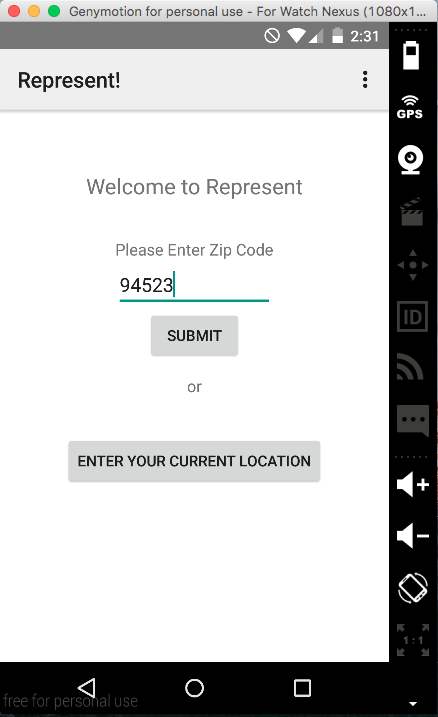
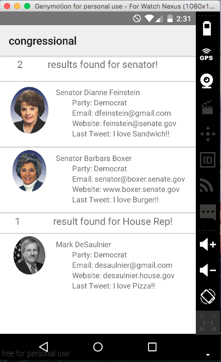
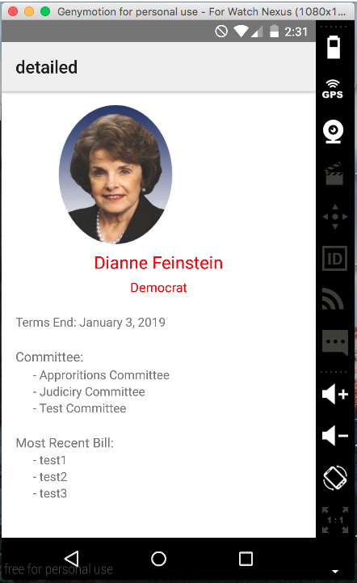
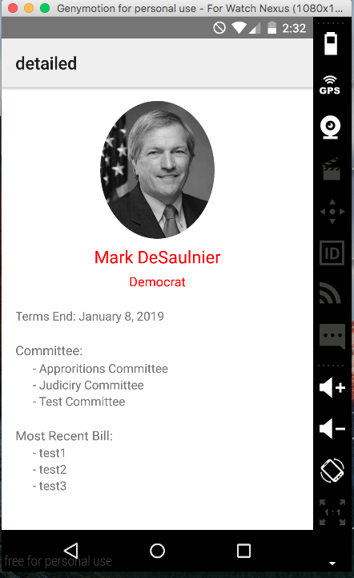
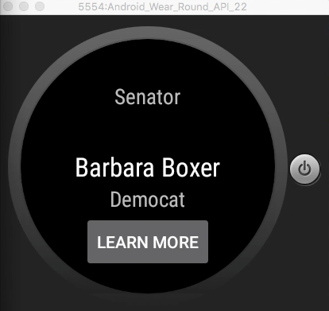
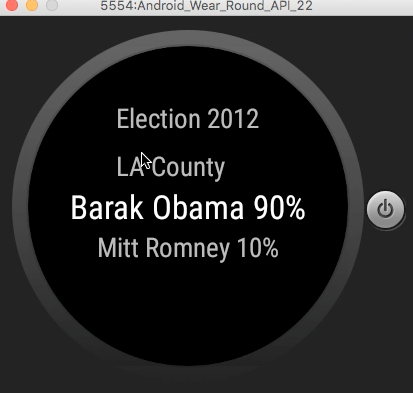
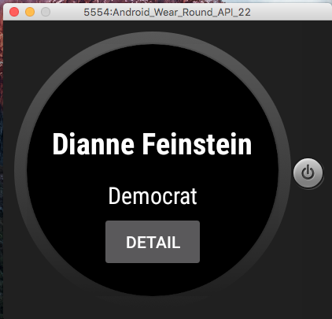
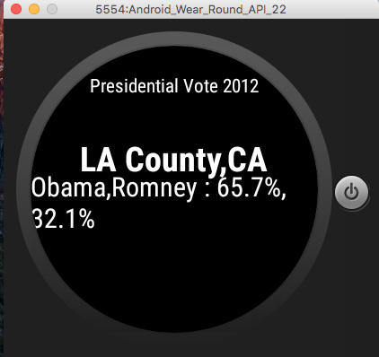

# PROG 02: Represent!

Briefly describe your app here.

## Authors

Nicholas Latief ([nicholasal@berkeley.edu](mailto:your_email@berkeley.edu))

## Demo Video

See https://vimeo.com/157896245 (https://link_to_your_video)

## Screenshots

## Acknowledgments

* Hat tip to anyone who's code was used
* Any other support
